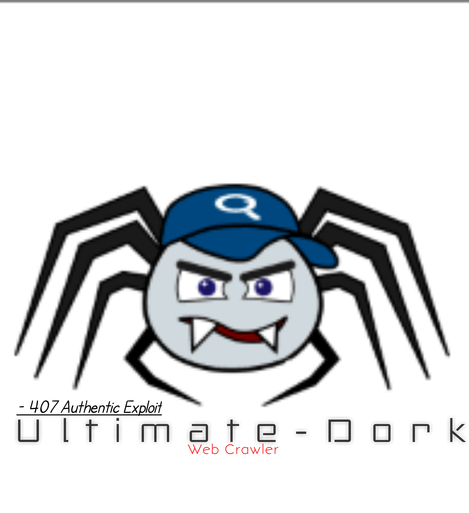

### Ultimate-Dork 

<b>web crawler And Scan SQL injection vulnerability<b><br>
 
#### Usage & Installation
```
- Installation
apt-get install python python3 git
git clone https://github.com/jaxBCD/Ultimate-Dork.git
python3 -m pip install requests mechanicalsoup 
cd Ultimate-Dork

 - Usage 
 python3 ultimate-dork.py -h *show help and description
 
* Default Crawling
python3 ultimate-dork.py --dork keyword 
 
 * with Scan SQLi vulnerability
 python3 ultimate-dork.py --dork keyword --scan

 * with Proxy
 python3 ultimate-dork.py --dork keyword --proxy 0.0.0.0:1337
 
 
```
 <b>[ update ] :</b> 19 March 2019
 
#### COPYRIGHT©2019 https://github.com/jaxBCD
